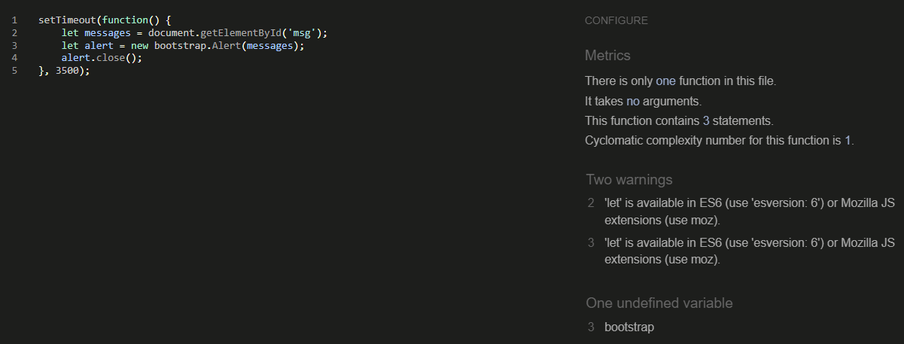

# **TraderPro**
"TraderPro" is a blog about daytrading. This blog is for people that want to follow my daytrading journey, and of course for all daytraders out there.
This blog will have blogposts/information about daytrading added by me weekly, so this blog will have alot of posts about daytrading in the future... so bookmark this blog now: https://daytradingblog.herokuapp.com/
  

  

## Features

When a user performs an action on the site, he/she will get an alert message at top of page that automatically disappear in 3,5 sec. (actions: signup, login, logout, commenting blogpost)

* **Header navigation bar**

    - The navigation bar includes links to Home, Signup and Login (and a logo-link), and also a short message.
    - This full responsive navigation bar allow all users to easy navigate to all pages on this site, without the need of the "back" button.
    - This bar also have a hover effect that change color with mousehover.

  

* **Main image**

    - The main image is a picture of big buildings (associates to wallstreet etc).
    - And this image also got an eye catching overlay text, that tell the user that he/she is on the perfect site he/she was looking for.

  

* **Blogpost section**

    - This section got 6 blogposts with title and excerpt text under the image. This will let the user to click on a blogpost he/she is interested in to read the fully information.
    - Below the images there's 'bloglikes' count, and 'blogcomment' count, so users can see the most engaging posts.
    - All titles/excerpts on this section got a link, and this link will redirect the user to the full information about the title.
    - When there's over 6 blogpost published, a 'next page' button will appear at bottom, when clicked - it will load more blogposts, and a 'prev page' button will be shown instead, so the user can go back easily.

  

* **Footer section**

    - The footer section got 4 social media pictures with links that opens up in a new tab (facebook, twitter, instagram, linkedin).
    - This section also have a copyright text (below the social media pictures), and also a link to main page.

  

* **Signup**

    - The 'Signup' page have 4 inputs (username, email, password, confirm password) that the user will need to fill in (email is optional), and a Signup button.
    - Below the Signup text there's a link to the Login page if user already have an account.

  

* **Login**

    - The 'Login' page have 2 inputs that a user need to fill in ('username' and 'password') and click the 'Login' button to login.
    - Below the Login text there's a link to the Signup page, if user want to create an account.

  

* **Logout**

    - When a user want to logout, he/she can just click the 'Logout' button in the navbar.
    - The user will get a confirmation text if he/she really want to logout.

  

* **Blogpost page**

    - First there is a blogpost image that is relevant to the topic.
    - A blogpost title is shown below the image, and also who the 'author' is, and even a 'date' when the post was published.
    - Below the title the user can read the full blogpost text.
    - And below the text there is a 'like-button' that also show the like-counts (formed as a heart), and a 'comment' count. Logged in users can 'like' and 'unlike' a blogpost, and when user comment a blopgpost it will add +1 to the comment count.
    - At bottom there's a comment section. Here will all the comments that are posted on a specific blogpost be shown. If a user is logged in, he/she can write a comment (a comment need to be approved by an admin user). If user is not logged in, he/she can only read the comments (not post a comment).

  

## Wireframes

I followed this design: https://startbootstrap.com/previews/clean-blog
 
(I did a few changes to the better)
  

## Django administration

* **Admin panel**

    - Create posts: As an admin, you can choose to create a blog post. You can easily save it as a draft and continue on it later - until you are ready to publish it.
    - Update posts: As an admin, you can easy update a blog post if you need to change something.
    - Delete posts: As an admin, you can easy delete a blog post if you need to.
    - Approve comments: As an admin, you choose which comments you want to be shown on the website.
    - Delete comments: As an admin, you can delete comments whether they are approved or not.
    - Filter blog posts: As an admin, you can filter the blog posts by date.
    - Delete users: As an admin, you can delete users if you need to.

  

## UX

A daytrader will find this blog as a perfect match!
I bet the user will read all the blog posts.
  

* **User stories**

NEW USER: I am interested in Daytrading and wanna know more about this lifestyle! 
RETURNING USER: User can come back weekly, as new blogposts are added once a week.

    - Site pagination: As a Site User I can view a list of posts so that I can select which post to view.
    - View post list: As a Site User I can view a list of posts so that I can select one to read.
    - Open a post: As a Site User I can click on a post so that I can read the full text.
    - View likes: As a Site User I can view the number of likes on each post so that I can see which is the most popular or viral.
    - View comments: As a Site User I can view comments/view comment count on an individual post (on main page I can see comment count) so that I can read the conversation.
    - Account registration: As a Site User I can register an account so that I can comment and like.
    - Comment on a post: As a Site User I can leave comments on a post so that I can be involved in the conversation. (comments need to be approved by an admin)
    - Like/Unlike: As a Site User I can like or unlike a post so that I can interact with the content.

* **Future updates**

    - Add a contact section, so users easily can contact me using a form.
    - Add alot more blogposts, and a filter so users easily can sort the blogposts how they want.
    - Add more features for the users, such as deleting/change their own comment posts, delete their accounts etc.
  

* **Site goal**

    - The goal of the blog is to inform users about daytrading.
  

* **Business owner**

    - I want to give my daytrading knowledge to my users, and build up a big daytrading community.
    - This blog will add alot of positive vibes to the users.
  

## Testing

Manually tested all links, buttons on every page in different browsers with no errors. Create new account, login, logout and post a comment works perfectly.
  
Everything looks OK (and fully responsive).
  
In admin panel everything works - approve comments, delete comments, create blogposts, delete blogposts, see all user/admin accounts. There's even a 'filter' on the right, so you easily can navigate.
  

* **Validator testing**

    - HTML: No errors when checked with "W3C validator": https://validator.w3.org/
    - CSS: No errors when checked with "Jigsaw validator": https://jigsaw.w3.org/css-validator/
    - Javascript: No errors when checked with: https://jshint.com/
    - Python: No errors when checked with (all .py files checked): http://pep8online.com/
    - This site is responsive. Different browsers work with this site (firefox, chrome, safari, edge). All links and buttons work.
    - 'Lighthouse' with site tested, with good score.

  

## Bugs

    - No bugs detected.

## Unfixed bugs

    - No unfixed bugs.

## Technologies

* **Languages used**

    - HTML
    - CSS
    - Javascript
    - Python+Django

## Programs and apps

    - Gitpod, used for code writing.
    - Github, store data.
    - Git, version control.
    - PostgreSQL, database.
    - Cloudinary, store images.
    - Summernote, WYSIWYG editor.
    - Bootstrap, css framework.
    - Crispy forms, manage django forms.
    - Allauth, account management.
    - Heroku, cloud deployment platform.

## Deployment

* **Site deployed to Heroku. The steps are:**

Detailed instructions found here (credit: Code Institute):
https://codeinstitute.s3.amazonaws.com/fst/Django%20Blog%20Cheat%20Sheet%20v1.pdf

    - Create an account with Heroku.
    - Create a new app whilst logged in.
    - Add Buildpacks 'Python' and 'NodeJS'.
    - Connect your GitHub repository via "Connect to GitHub".
    - Set up your config vars (info in doc above).
    - Enable either "Automatic Deploys" or do it manually.
    - The site link: https://daytradingblog.herokuapp.com/

## Credits

In order to have time to do a large project like this in such a short time (8 days, yepp you read it correct, do I have the student record? :)), I had to follow the Code Institute's guide (big credit) to be able to finish this website, and get it up and running without problems.
Credit to my brother Daniel Junttila for working with me along the project.
To complete this 'TraderPro blog', I used Code Institute student template: https://github.com/Code-Institute-Org/gitpod-full-template
  

* **Content**

    - All blogpost content found at: https://en.wikipedia.org/wiki/Day_trading
    - Fonts (Lato, Open Sans) imported from https://fonts.google.com/
    - Color palette picked from https://colorhunt.co/
  

* **Media**

    - All the images taken from https://www.pexels.com/
    - The icons is taken from https://fontawesome.com/
    - Used GIMP for scaling the images.
  

* **Colors and fonts**

    - Background color: #F9FAFC
    - Logo color: #4A4A4F and #F08A5D
    - Body font color: #000000
    - Button color: #F08A5D
    - Heading font color: #000000
    - Fonts used: 'Lato' and 'Open Sans'.
  

[Back to Top](#TraderPro)